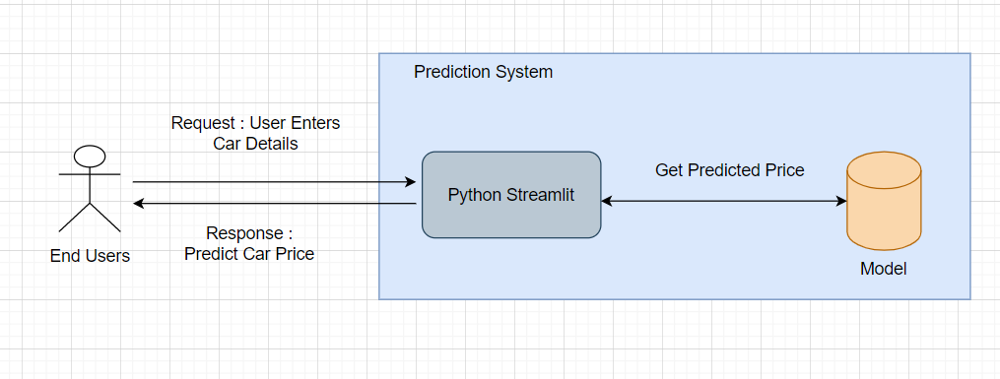

# Car Price Predictor

  

This project's main goal is to produce used car price prediction using `Random Forest Regressor`.

An ensemble learning technique is used for classification and regression in the supervised learning algorithm known as random forest.

In contrast to boosting techniques, random forest is a bagging approach. In random forests, the trees grow in parallel, therefore there is no interaction between them as they grow.

In order to perform classification or regression, random forest builds a large number of decision trees during training and then outputs the class that represents the mean of the predictions made by each tree.

## Architechture

## Screenshot

## Project Execution

1. Install this repository locally by cloning it or downloading it.
2. Using the command `pip install -r requirements.txt`, install every library included in the requirements.txt file.
3. Run the file `main.py` by using the command `streamlit run main.py` at the terminal or command line after opening your project directory (Car Price Prediction Directory).
4. Cheers! The website will launch.

        Note : Specific requirement.txt is also there in order to run the notebook as well.
## Deployment
Website is created using streamlit and hosted in heroku.
## Core Concept

1.  Random forest is just a team of decision trees. The final prediction of the
random forest is simply the average of the different predictions of all the different decision trees.
2. Build the decision tree associated to these k data points.
3. Choose the number Ntrees of trees you want to build and repeat Steps 1&2.
4. For a new data point, make each one of your NTree trees predict the value of Y for the data point in question, and assign the new data point the average across all of the predicted Y values.
## Links

1. Dataset - https://www.kaggle.com/datasets/nehalbirla/vehicle-dataset-from-cardekho
